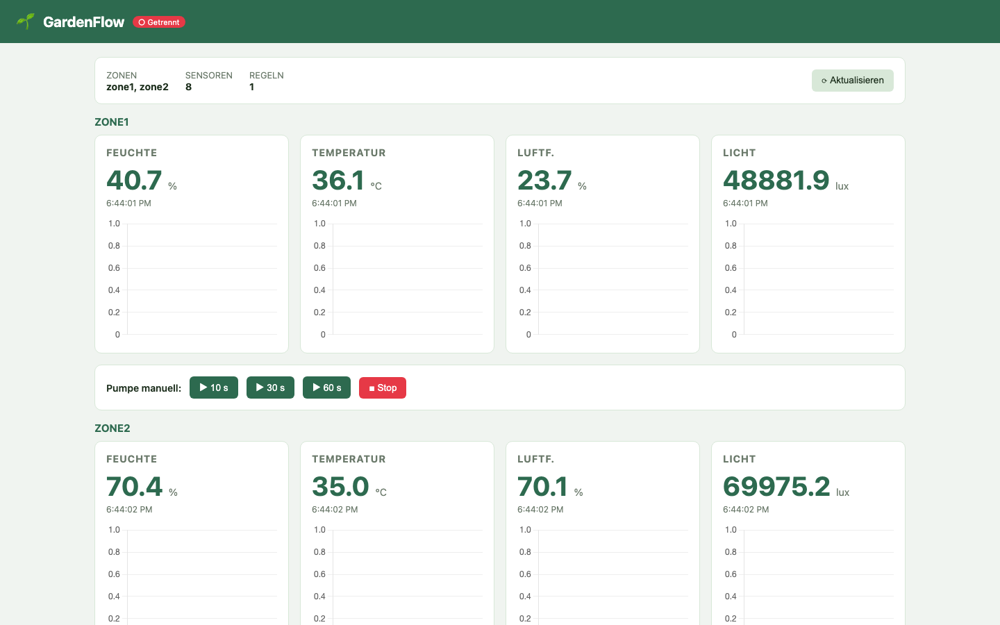

<div align="center">
  

  <h1>GardenFlow</h1>
</div>

[🇩🇪 Deutsche Version](README.de.md)

[](https://github.com/9t29zhmwdh-coder/GardenFlow/actions)    

A modular Home Garden Automation Toolkit; connect sensors (ESP32, Zigbee, MQTT), define automation rules, and visualise everything in a real-time web dashboard.

Runs on **Linux, Windows, and macOS** via Docker.

> **How it runs:** GardenFlow is not an installable program: there is no `.exe`, `.dmg`, or `.deb`. It is a small server you start locally with Docker and then use in your browser at `http://localhost:8000`. There is no installer, no system tray icon, and no auto-start. You start and stop it explicitly with `docker compose up` / `docker compose down`.



---

**In practice:** you get a live graphical dashboard in your browser showing every sensor reading in real time, plus a rules editor to automate watering, with no coding required after setup.

## Features

- **MQTT Integration**: connects to any MQTT broker; auto-discovers sensor topics under `garden/sensors/{zone}/{type}`
- **Logic Engine**: rule-based automation with AND/OR conditions, configurable cooldown, actions: activate pump, send alert
- **Real-time Dashboard**: Chart.js live charts, manual pump control, rule management; no build step, no framework
- **REST API**: clean endpoints, auto-generated Swagger UI at `/docs`
- **WebSocket stream**: push sensor events to all connected clients
- **Cross-platform**: `pathlib.Path` throughout, no shell-specific code, `tools/test_sensor.py` as a CLI-independent simulator
- **Extensible**: add new sensor types via `SensorType` enum, new actuators via `ActuatorType` + handler

---

## Requirements

- [Docker](https://www.docker.com/) + Docker Compose **or** Python 3.12+ (local dev)

---

## Quick Start (Docker)

```bash
git clone https://github.com/9t29zhmwdh-coder/GardenFlow
cd GardenFlow
cp .env.example .env
docker compose up -d
```

Open **http://localhost:8000** and the dashboard loads immediately.

Simulate sensor data (cross-platform):

```bash
pip install aiomqtt
python tools/test_sensor.py
```

---

## Local Development (no Docker)

```bash
# Linux / macOS
bash scripts/dev.sh

# Windows (PowerShell)
.\scripts\dev.ps1
```

---

## Uninstall / Cleanup

```bash
docker compose down -v               # stops containers, removes the garden_data volume (sensor DB)
rm -rf mosquitto/data mosquitto/log  # remove local MQTT broker data (bind-mounted, not covered by -v)
rm .env                              # remove local config
```

Nothing is written outside the repo folder, the `garden_data` Docker volume, and the `mosquitto/` data directories above.

---

## Architecture

```
MQTT Broker (Mosquitto)
    │
    ▼  aiomqtt subscriber
Backend (FastAPI / Python 3.12)
    ├── MQTT client        # subscribe garden/# → parse → persist + broadcast
    ├── Sensor repository  # SQLite (WAL) in-memory cache + history
    ├── Logic engine       # evaluate rules on every reading
    ├── Actuator controller # publish MQTT commands (pump on/off)
    └── WebSocket registry  # broadcast events to all dashboard clients
    │
    ▼  StaticFiles mount
Frontend (Vanilla JS + Alpine.js + Chart.js)
    # served directly from FastAPI, no build step
```

---

## MQTT Topic Schema

| Topic | Direction | Payload |
|---|---|---|
| `garden/sensors/{zone}/{type}` | Device → Broker | `{"value": 42.5, "unit": "%"}` |
| `garden/actuators/{zone}/pump/set` | Broker → Device | `{"action": "on", "duration": 10}` |
| `garden/actuators/{zone}/pump/status` | Device → Broker | `{"state": "on"}` |

---

## API Overview

| Method | Path | Description |
|---|---|---|
| GET | `/api/sensors` | All latest sensor values |
| GET | `/api/sensors/{zone}` | Zone sensor values |
| GET | `/api/history/{type}/{zone}` | History (`?hours=24`) |
| GET | `/api/rules` | List all rules |
| POST | `/api/rules` | Create rule |
| PUT | `/api/rules/{id}` | Update rule |
| DELETE | `/api/rules/{id}` | Delete rule |
| POST | `/api/actuators/{zone}/pump` | Manual pump control |
| GET | `/api/status` | System status |
| WS | `/ws` | Real-time sensor stream |

Full interactive docs: **http://localhost:8000/docs**

---

## Example: Create an Automation Rule

```bash
curl -X POST http://localhost:8000/api/rules \
  -H "Content-Type: application/json" \
  -d '{
    "name": "Low Moisture Auto-Water",
    "conditions": [
      {"sensor_type": "moisture", "zone": "zone1", "operator": "<", "threshold": 30},
      {"sensor_type": "temperature", "zone": "zone1", "operator": ">", "threshold": 20}
    ],
    "condition_logic": "AND",
    "action": {"type": "activate_pump", "zone": "zone1", "duration_seconds": 10},
    "cooldown_seconds": 300
  }'
```

---

## Extending

**New sensor type:** add value to `SensorType` enum in `backend/sensors/models.py` and `backend/rules/models.py`.

**New actuator:** add handler in `backend/actuators/controller.py`, register in `ActionType` in `backend/rules/models.py`.

---

---

**Author:** [Rafael Yilmaz](https://github.com/9t29zhmwdh-coder) · **Status:** Active ·  · **License:** MIT
